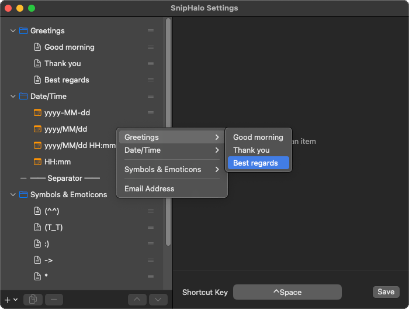

# SnipHalo

macOS メニューバー常駐のスニペットマネージャー。カスタマイズ可能なホットキーでスニペットメニューを呼び出し、定型文や日付をすばやく貼り付けできます。

## 特徴

- **ホットキーで即呼び出し** — デフォルトは `Ctrl+Space`（設定UIで変更可能）
- **テキストスニペット** — 定型文・署名・メールアドレスなどをワンクリックで貼り付け
- **日付・時刻** — `yyyy-MM-dd` などのフォーマットで現在日時を自動挿入
- **フォルダ整理** — スニペットを階層的に整理（サブメニュー表示）
- **設定UI** — ドラッグ&ドロップで並べ替え、フォルダ間移動、項目の複製に対応
- **クリップボード保持** — 貼り付け後に元のクリップボード内容を復元

## 必要環境

- macOS 13.0 (Ventura) 以降
- Swift 5.9 以降 / Xcode Command Line Tools
- アクセシビリティ権限（初回起動時に許可ダイアログが表示されます）

## ビルド・インストール

```bash
git clone <repository-url>
cd SnipHalo
./build.sh
```

`SnipHalo.app` が生成されます。`/Applications` に移動して起動してください。

## 使い方

1. 起動するとメニューバーにアイコン（笑顔）が表示されます
2. `Ctrl+Space` でスニペットメニューが表示されます
3. 項目をクリックすると、カーソル位置にテキストが貼り付けられます

### ステータスバーアイコン

| 操作 | 動作 |
|------|------|
| シングルクリック | メニュー表示 |
| ダブルクリック | 設定UIを開く |
| 右クリック | メニュー表示 |

### 設定UI

メニューから「設定...」またはアイコンをダブルクリックで開きます。

- **項目の追加** — `+` ボタンからテキスト / 日付・時刻 / フォルダ / 区切り線を追加
- **項目の複製** — ツールバーの複製ボタン（書類アイコン）
- **並べ替え** — 右端のドラッグハンドル（≡）でドラッグ&ドロップ
- **フォルダへ移動** — フォルダ行にドロップするとフォルダ内に移動
- **フォルダから取り出す** — リスト下部の「ルート」ゾーンにドロップ
- **ホットキー変更** — 画面下部のホットキー欄をクリックして任意のキーを録音

## 設定ファイル

```
~/Library/Application Support/SnipHalo/config.json
```

初回起動時にサンプル設定が自動生成されます。設定UIから編集するほか、JSONを直接編集することもできます（メニューの「Edit Config JSON...」）。

### 設定例

```json
{
  "version": 1,
  "hotkey": { "key": "space", "modifiers": ["control"] },
  "items": [
    {
      "type": "folder",
      "title": "挨拶",
      "items": [
        { "type": "text", "title": "お疲れ様です", "text": "お疲れ様です。\nいつもお世話になっております。" }
      ]
    },
    { "type": "date", "title": "今日の日付", "format": "yyyy-MM-dd" },
    { "type": "separator" },
    { "type": "text", "title": "メールアドレス", "text": "user@example.com" }
  ]
}
```

### アイテムの種類

| type | 説明 | 固有フィールド |
|------|------|----------------|
| `text` | テキストスニペット | `text` — 貼り付けるテキスト |
| `date` | 日付・時刻 | `format` — `DateFormatter` フォーマット文字列 |
| `folder` | フォルダ（サブメニュー） | `items` — 子アイテムの配列 |
| `separator` | 区切り線 | なし |

## プロジェクト構成

```
Sources/SnipHalo/
├── main.swift
├── AppDelegate.swift
├── Models/
│   ├── Config.swift            # AppConfig, HotkeyConfig
│   └── MenuItem.swift          # MenuItemConfig, MenuItemType
├── UI/
│   ├── SettingsView.swift      # 設定画面 (SwiftUI)
│   ├── SettingsViewModel.swift # 設定ロジック
│   ├── SettingsWindowController.swift
│   ├── StatusBarController.swift
│   └── HotkeyRecorderView.swift
├── Services/
│   ├── ConfigManager.swift     # 設定の読み書き
│   ├── MenuBuilder.swift       # NSMenu 構築
│   ├── HotkeyManager.swift     # グローバルホットキー (Carbon API)
│   ├── PasteService.swift      # クリップボード操作・貼り付け
│   └── AccessibilityHelper.swift
└── Utilities/
    └── Constants.swift
```

## ライセンス

MIT
